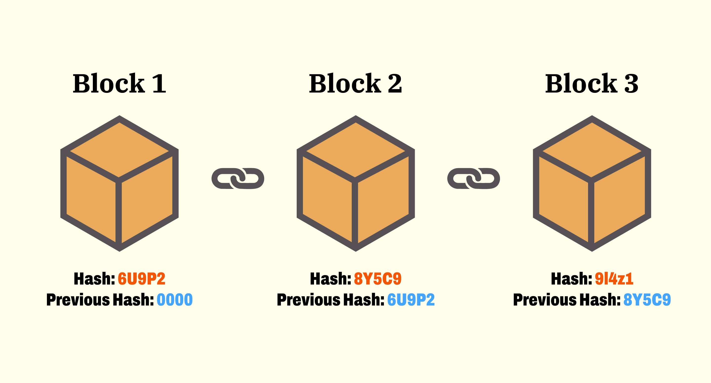
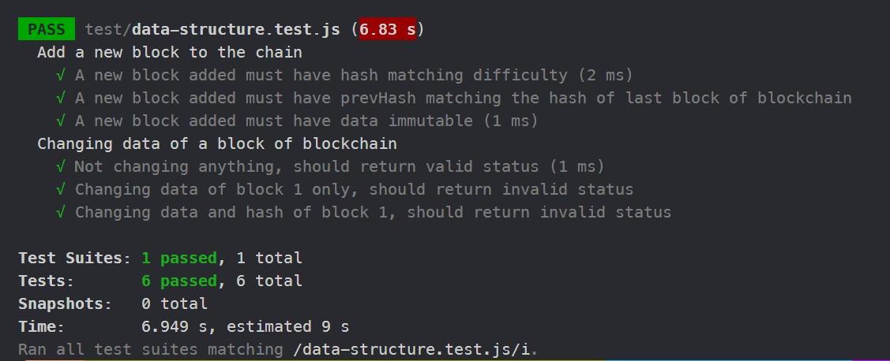

## Testing JS data structure using JEST
### In this demo, we wil use a basic blockchain data structure 
First of all, you can simply understand that blockchain is just a linked list, which contains multiple blocks. Each block has its own hash code and connect to the previous block via that one's hash code.
*(See image below)*


**So in JS, we need to build a Block class:**
```JS
const CryptoJS = require("crypto-js");
class Block {
    constructor(prevHash, data) {
        this.prevHash = prevHash
        this.data = data
        this.timestamp = new Date()
        this.hash = this.calculateHash()
        this.nonce = 0

    }

    calculateHash() {
        return CryptoJS.SHA256(this.prevHash + JSON.stringify(this.data) + this.timestamp + this.nonce).toString()
    }
  
    mine(difficulty) {
        while (!this.hash.startsWith('0'.repeat(difficulty))) {
            this.nonce++
            this.hash = this.calculateHash()
        }
    }
}
```

This block object has 5 properties: 
* ***prevHash***: connecting to the previous block's hash code
* ***data***: containing whatever data you want
* ***timestamp***: the time that creates this block
* ***hash***: the code to identify this block, which can be obtained by using SHA256 hashing algorithm from existing crypto-js module (npm i crypto-js) to hash 4 fields: prevHash, data, timestamp and nonce. (we use calculateHash() function to return this hash)
* ***nonce***: In blockchain, for security purpose, you can not create hash code by anything you want but following a **difficulty** level, for example creating a hash that starts with four '0'. So that this **'nonce'** property is an auto-increasing natural number that help change the body of hash function to generate a different hash each time until we obtain the appropriate hash (conducted in mine() function)

**To have a blockchain, we need to build a BlockChain class**:
```JS
class BlockChain {
    constructor(difficulty) {
        const genesisBlock = new Block('0000', {isGenesis: true})
        this.chain = [genesisBlock]
        this.difficulty = difficulty
    }
  
    getLastBlock() {
        return this.chain[this.chain.length - 1]
    }

    addBlock(data) {
        const lastBlock = this.getLastBlock();
        const newBlock = new Block(lastBlock.hash, data)
        newBlock.mine(this.difficulty)
        this.chain.push(newBlock)
        return newBlock;
    }

    isValid() {
        for (let i = 1; i < this.chain.length; i++) {
            const currentBlock = this.chain[i]
            const prevBlock = this.chain[i - 1]
            if (currentBlock.hash !== currentBlock.calculateHash())
                return false
            if (currentBlock.prevHash !== prevBlock.hash)
                return false
        }
        return true
    }
}
```
To simplify the demo, we will store all the blockchain in an array. The first element of the array, which is the first block, is called **genesis block**. All other blocks will be added after this block. 
In this BlockChain class, we have a function call isValid(), this is for validating all the blockchain, which means that if the data of a specific block was tampered, the status of the whole chain would be false.

That's all for creating a basic blockchain structure, now we add some blocks to the blockchain.
```JS
const blockChain = new BlockChain(4) //We set the difficulty 4, which means the hash must start with '0000'.

blockChain.addBlock({
    from: 'Tien',
    to: 'Khanh',
    amount: 100
})
blockChain.addBlock({
    from: 'Sy',
    to: 'Sang',
    amount: 500
})
blockChain.addBlock({
    from: 'Sang',
    to: 'My',
    amount: 200
})
blockChain.addBlock({
    from: 'My',
    to: 'Kiet',
    amount: 300
})
```

Now, we will test the blockchain which was created in these cases after inserting a new block to the blockchain:
```JS
let data = {
        from: 'Khanh',
        to: 'My',
        amount: 200
    }
    const lastBlock = blockChain.getLastBlock()
    blockChain.addBlock(data)
```
1. A new block added must have hash matching difficulty
```JS
it('A new block added must have hash matching difficulty', () => {
        const addedBlock = blockChain.getLastBlock()
        const regex = new RegExp('^0{' + difficulty + '}')
        expect(addedBlock.hash).toMatch(regex)
    })
```

2. A new block added must have prevHash matching the hash of last block of blockchain
```JS
it('A new block added must have prevHash matching the hash of last block of blockchain', () => {
        const addedBlock = blockChain.getLastBlock()
        // expect(addedBlock.prevHash).toBe(lastBlock.hash) --the same as toEqual()
        expect(addedBlock.prevHash).toEqual(lastBlock.hash)

    })
```

3. A new block added must have data immutable
```JS
it('A new block added must have data immutable', () => {
        const addedBlock = blockChain.getLastBlock()
        const testData = {
            from: 'Khanh',
            to: 'My',
            amount: 200
        }
        // expect(addedBlock.data).toBe(testData) -- this won't work because object is a reference type
        expect(addedBlock.data).toEqual(testData)
        expect(addedBlock.data).toMatchObject({amount: 200})
    })
```

For validation of the blockchain when a block's data has been tampered, we will test with these cases:
1. Not changing anything, should return valid status
```JS
it('Not changing anything, should return valid status', () => {
        expect(blockChain.isValid()).toBeTruthy()
        // expect(blockChain.isValid()).not.toBeFalsy() --the same as above method
    })
```

2. Changing data of block 1 only, should return invalid status
```JS
it('Changing data of block 1 only, should return invalid status', () => {
        block1.data = {
            from: 'Tien',
            to: 'Khanh',
            amount: 50 //changing 100 to 50
        }
        expect(blockChain.isValid()).toBeFalsy()
    })
```

3. Changing data and hash of block 1, should return invalid status
```JS
it('Changing data and hash of block 1, should return invalid status', () => {
        block1.data = {
            from: 'Tien',
            to: 'Khanh',
            amount: 50 //changing 100 to 50
        }
        block1.hash = block1.calculateHash() //changing hash of block as well
        expect(blockChain.isValid()).toBeFalsy()
    })
```

Let's see the result after these tests: 

