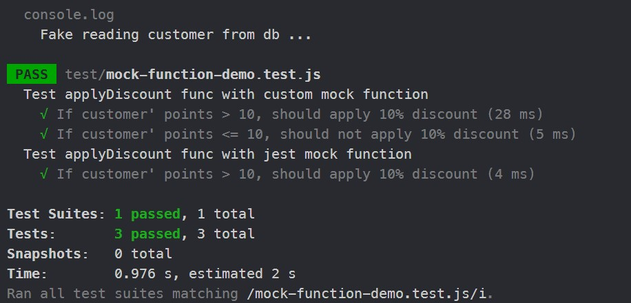

## Mock function demo code in JEST framework
Imagine you have to test a function that needs to connect to a third-party service (like the database, or api from another server).
```JS
const db = require('./db-connect')
applyDiscount = (order) => {
    const customer = db.getCustomerSync(order.customerId)
    if (customer.points > 10) order.totalPrice *= 0.9
}
```

```JS
//File db-connect.js
getCustomerSync = (id) => {
    console.log('Reading a customer from database')
    return {id: id, points: 15}
}
```

This JS function applyDiscount() needs to call function db.getCustomerSync() which then will get data from database mongoDB to return a customer based on customerId. If that customer has the points property greater than 10, his order total price will be discounted by 10%. 
**The problem here is that** when applying unit testing, we just need to focus on the code of the function only without any concern about the other service, what if there's some problem when connecting to the database and the test return error (red notification) while the main code of the function face with no bugs ?. That's the reason why with unit testing, we have to create a mock function, which means mock all the operation of the original function to return a particular data to test our main code in the main function.

#### We have two ways to create mock function in our test.
1. **First is conducting a manual mock function by overriding the original one:**
```JS
//We conduct this override function in each test case
db.getCustomerSync = (id) => {
            console.log('Fake reading customer from db ...')
            return {id: id, points: 20}
        }
```

The whole test will be:
```JS
const db = require('../db-connect')
describe('Test applyDiscount func with custom mock function', () => {
    it('If customer\' points > 10, should apply 10% discount', () => {
        db.getCustomerSync = (id) => {
            console.log('Fake reading customer from db ...')
            return {id: id, points: 20}
        }
        let order = {
            customerId: 1,
            totalPrice: 10
        }
        applyDiscount(order)
        expect(order.totalPrice).toBe(9)
    })

    it('If customer\' points <= 10, should not apply 10% discount', () => {
        db.getCustomerSync = (id) => {
            console.log('Fake reading customer from db ...')
            return {id: id, points: 10}
        }
        let order = {
            customerId: 1,
            totalPrice: 10
        }
        applyDiscount(order)
        expect(order.totalPrice).toBe(10)
    })
})
```

2. **JEST framework supports us an operation to create mock function, which can mock implementation or mock the return value**
```JS
//Create jest mockfunction
	const mockFunction = jest.fn()
    mockFunction.mockReturnValue(1)
    mockFunction.mockImplementation(() => ...)
```

The whole test will be:
```JS
describe('Test applyDiscount func with jest mock function', () => {
    it('If customer\' points > 10, should apply 10% discount', () => {
        //Change implementation
        // db.getCustomerSync = jest.fn(id => {
        //     return {
        //         id: id,
        //         points: 20
        //     }
        // })

        //Mock implementation
        // db.getCustomerSync = jest.fn()
        // db.getCustomerSync.mockImplementation((id) => {
        //     return {
        //         id: id,
        //         points: 20
        //     }
        // })
        //Mock return value
        db.getCustomerSync = jest.fn().mockReturnValue({
            id: db.getCustomerSync.mock?.calls[0][0],
            points: 20
        })
        let order = {
            customerId: 1,
            totalPrice: 10
        }
        applyDiscount(order)
        expect(order.totalPrice).toBe(9)
        expect(db.getCustomerSync).toHaveBeenCalled()
        expect(db.getCustomerSync).toHaveBeenCalledWith(1)
        expect(db.getCustomerSync.mock.calls[0][0]).toBe(1)
    })
})
```

Let's see the result after these tests: 
